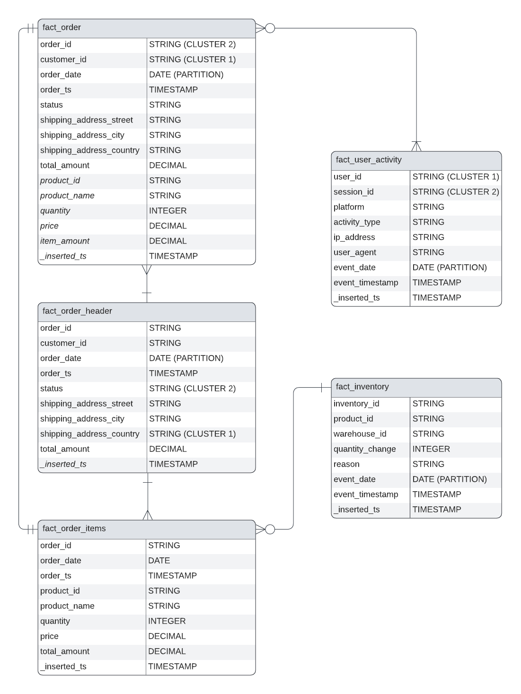
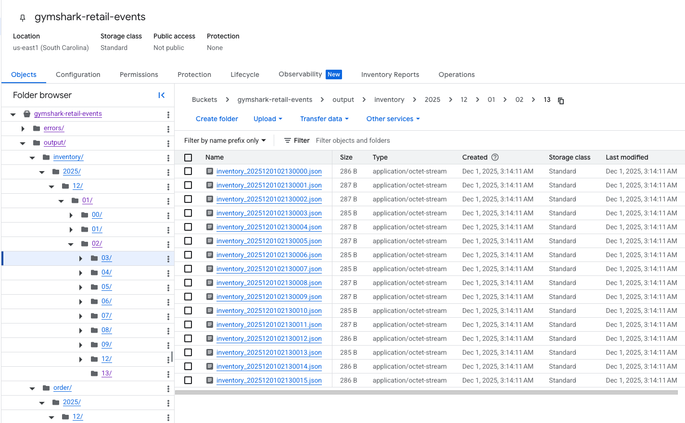
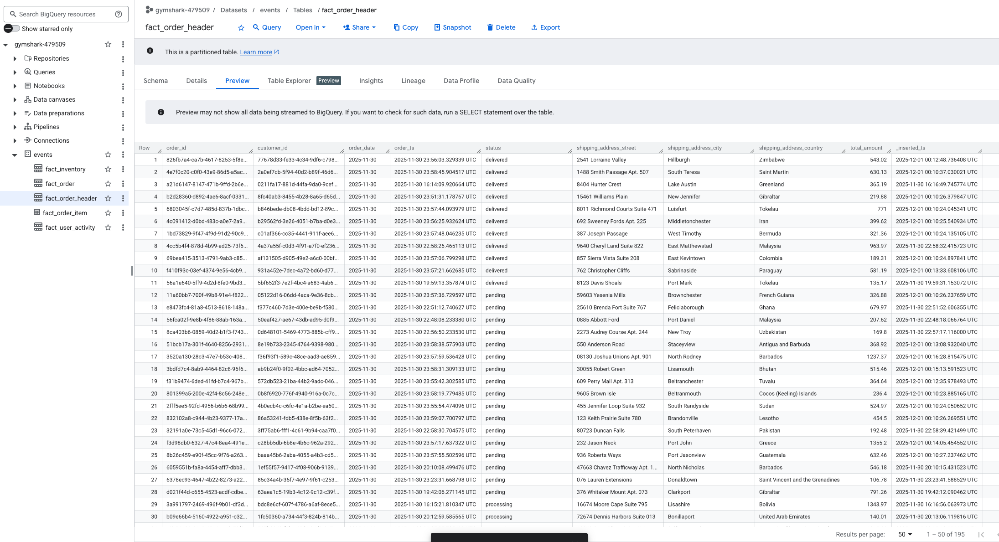
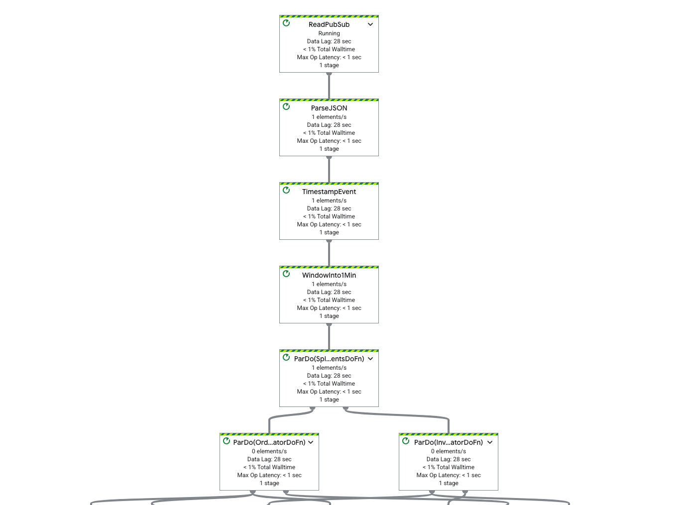
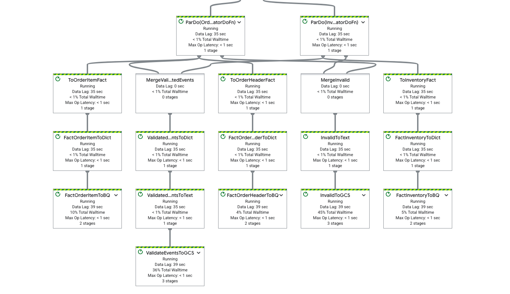
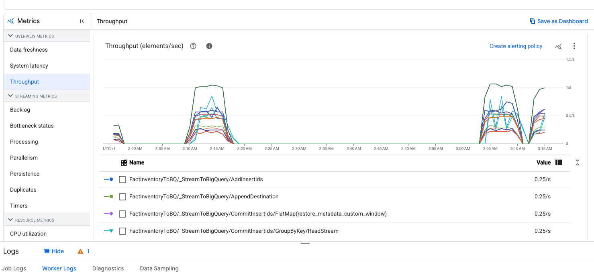

# Retail-Dataflow  
[vgonzenbach/retail-dataflow](https://github.com/vgonzenbach/retail-dataflow)  

A streaming Apache Beam / Google Cloud Dataflow pipeline that ingests retail-ecommerce events and loads transformed data into BigQuery + Google Cloud Storage.

## Data Models



The data model follows a Kimball-style dimensional design with the following tables:
- `fact_order_header`  
- `fact_order_item`  
- `fact_order`  
- `fact_inventory`  
- `fact_user_activity`  

DDL statements can be found in the [sql](./sql) folder.

### Order Header

`fact_order_header` stores high-level order data for coarse analytics (e.g. orders per country, order status).
It can be used for coarse financial analytics per country, or for operational insights based on status. Hence, the table is partitioned by `order_date` and clustered by `shipping_address_country` and `status` allowing country-level and status-level aggregations for the mentioned use cases to be performed efficiently. 

For instance, the following query counts the number of delivered orders per country:

```sql
SELECT 
    shipping_address_country,
    COUNT(*) AS delivered_orders
FROM 
    events.fact_order_header
WHERE 
    order_date = '2025-12-01'
    AND status = 'delivered'
GROUP BY 
    shipping_address_country
ORDER BY 
    shipping_address_country

```

* `fact_order_header` is derived from order events by dropping item-level information and flattening the address fields to allow clustering on `shipping_address_country` and for improving usability of the end-user. 

### Order Item

`fact_order_item` is a table that contains the order details at the item level. It is used for product-centric analytics. The table is partitioned by `order_date` and clustered by `product_id`. This allows product-level aggregations to be performed efficiently. It can be efficiently joined with the `fact_inventory` table to get the current inventory quantity for a product.

For instance, the following query counts the number of orders per product:

```sql
SELECT 
    product_id,
    MAX(product_name) AS product_name, -- pick any
    COUNT(DISTINCT order_id) AS orders,
    SUM(quantity) AS total_items_sold,
    SUM(total_amount) AS total_revenue
FROM 
    events.fact_order_item
GROUP BY 
    product_id
ORDER BY 
    product_id
```

* `fact_order_item` is derived from order events by exploding the items array, computing `total_amount` for each line item and enriching with order-level details such as `order_id` (for reference) and `order_date` (for partitioning).


### Fact Order

`fact_order` contains full order data at item-level granularity. With clustering on `customer_id` (and `order_id`), it's optimized for customer-centric analytics. Useful when you need both header and item-level data in a single query, avoiding joins. It is partitioned by `order_date` and clustered by `customer_id`. This allows customer-level aggregations to be performed efficiently. It can be efficiently joined with the `fact_user_activity` as well.

A second clustering column on `order_id` allows for compression of the table since the explosion of the items array accounts for "duplicate" order-level data. By clustering on `order_id`, some storage savings can be achieved thanks to RLE compression.

As an example of usage, the following query counts the number of orders per customer:

```sql
SELECT 
    customer_id,
    MAX(customer_name) AS customer_name, -- pick any
    COUNT(DISTINCT order_id) AS orders,
    SUM(total_amount) AS total_revenue    
FROM 
    events.fact_order
GROUP BY 
    customer_id
ORDER BY 
    customer_id
```

Note that an argument could be made that this table is redundant with the previous two. In terms of storage it certainly is, but the different clustering strategies can be used to optimize distinct query needs. The user is encouraged to use the previous two tables if their use case requires only header-related or item-related data. 

### Inventory  
`fact_inventory` tracks inventory movements per product. Use it for stock-movement analytics (e.g. returns, restocks), especially since its clustered on `product_id` and movement `reason`.

For instance, the following query shows the products with the most returns:

```sql
SELECT 
    product_id,
    SUM(quantity_change) AS n_returns
FROM 
    events.fact_inventory
GROUP BY 
    product_id, reason
HAVING reason = 'return'
ORDER BY 2 DESC 
```

### User Activity

`fact_user_activity` captures user events (clicks, sessions, activity). Partitioned by `event_date` and clustered by `user_id` and `session_id`, it supports both user-level and session-level analytics

As a basic example, we can assign a step-in-session number to each activity in a user-session:

```sql  
SELECT
  user_id,
  session_id,
  event_timestamp,
  activity_type,
  ROW_NUMBER() OVER (
    PARTITION BY user_id, session_id
    ORDER BY event_timestamp
  ) AS step_in_session
FROM events.fact_user_activity;
```

#### Further Notes

All tables contain both date and timestamp columns for usability. An ingestion timestamp is automatically added by BQ to each row.


## Dataflow Pipeline

The Dataflow pipeline is defined in the [pipeline.py](./pipeline.py) file. It is a streaming pipeline that reads from Pub/Sub and writes processed events to the BigQuery and GCS sinks.

Functionalities include:

- Type-safe transformation
- Data validation
- Dead-letter queueing for invalid data (to GCS)
- Event-to-fact modeling
- Streaming ingestion into BigQuery fact tables

Transformations are implemented under [transforms](./transforms). Implementation details are left to the reader, but feel free to ask for help.

### Usage

1. Prepare infrastructure:
   - GCP project  
   - Pub/Sub topic + subscription  
   - BigQuery dataset + tables (use SQL in `sql/`)  
   - GCS bucket  
   - Enable Dataflow API  

2. Install dependencies (see `requirements.txt` — minimal set: `apache-beam[gcp]`, plus optional `faker` for testing).  

3. Update `PROJECT_ID` in `run.sh`, then run:

```bash
# chmod +x run.sh # if needed
./run.sh
```

In addition, the [requirements.txt](./requirements.txt) file contains the version-pinned dependencies required to run the pipeline. In reality, only two dependencies are required:
```sh
apache-beam[gcp]
faker # to generate data to test the pipeline
```

4. Generate fake data (optional):
```sh
python3 publish.py --topic=$TOPIC_ID -n 100
```
This produces multiple event types (orders, inventory, invalid events) for ingestion testing.

## Observability & Verification

Screenshots below illustrate the pipeline’s deployment, data storage structure, and runtime metrics — useful to validate behavior and performance.

---

### Google Cloud Storage Output Structure


  
**Caption:** *Windowed file outputs organized by year/month/day/minute for the `inventory` stream. This verifies correct sharding and timestamp-based partitioning.*

---

### BigQuery Fact Tables

  
**Caption:** *`fact_order_header` populated from the streaming Dataflow pipeline. Confirms schema alignment, timestamp parsing, and ingestion correctness.*

---

### Dataflow Job Graph – Stage 1

  
**Caption:** *High-level graph: Pub/Sub ingestion → JSON parsing → event timestamp assignment → fixed windows.*

---

### Dataflow Job Graph – Stage 2

  
**Caption:** *Downstream branching into order and inventory flows, with validation, dict conversion, BigQuery sinks, and invalid record routing to GCS.*

---

### Dataflow Throughput Metrics

  
**Caption:** *Elements/sec across major pipeline steps. Shows the throughput of the pipeline.*


### Known Limitations & TODOs

Due to time constraints, not all functionalities have been implemented. The following are the main missing features:

- Ingestion to `fact_order` in BigQuery is currently omitted to avoid redundancy.
- Support for `fact_user_activity` ingestion is incomplete — such events are presently routed to the “unknown” PCollection and ignored. 
- Schema-contract validation and full dead-letter queueing for unknown events remain as TODOs.
- Unit and integration tests are in progress.


### License & Contributing

Feel free to fork, use, or extend this repository. Contributions and issue reports are welcome.
